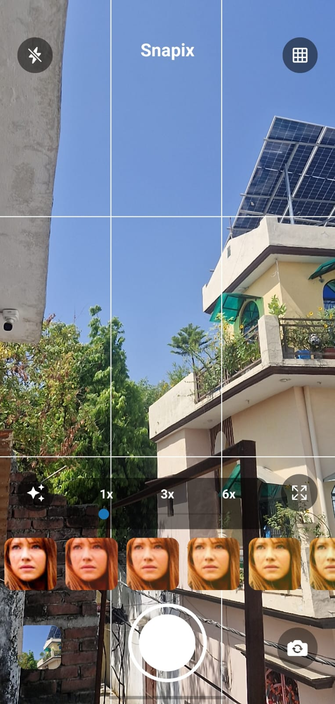
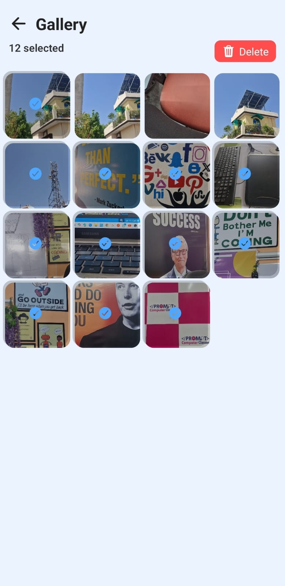
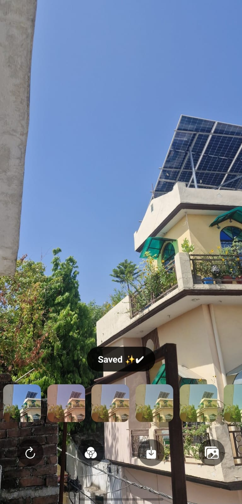

# 🚀 Snapix — From Idea to Reality

I challenged myself to build a real-world mobile app… and here it is — **Snapix** 📱  

A modern, feature-rich camera app inspired by social media platforms, built using **React Native & Expo**.

---

## ✨ What Makes Snapix Special?

### 📸 Smart Camera Experience
- Live camera preview with grid alignment  
- Smooth zoom controls (1x / 3x / 6x)  
- Flash support for better shots  
- Clean and responsive camera UI  

---

### 🎭 Real-time Filters
- Instant filter previews before capture  
- Multiple color tones & effects  
- Smooth transitions between filters  

---

### 🖼️ Gallery Management
- Clean grid-based layout  
- Multi-select with selection counter  
- Delete functionality for media  

---

### 💾 Seamless User Experience
- Instant save with confirmation  
- Retake, download & share options  
- Smooth animations & transitions  

---

## 🛠️ Tech Stack

- ⚛️ React Native  
- 🚀 Expo  
- 📘 TypeScript  

---

## 📸 App Preview

> Add your screenshots below 👇

## 📸 Camera

## 🖼️ Gallery

## 🎭 Filters

---

## 📚 What I Learned

- Handling device camera & permissions  
- Building responsive mobile UI  
- Managing media storage efficiently  
- Debugging real-world app issues  

---

## 🚀 Future Plans

- Advanced AI-based filters  
- Video recording support  
- Cloud backup integration  

---

## 💡 About Me

Built with passion by **Harshit Sharma** 💻  
Always learning, always building 🚀  

---

